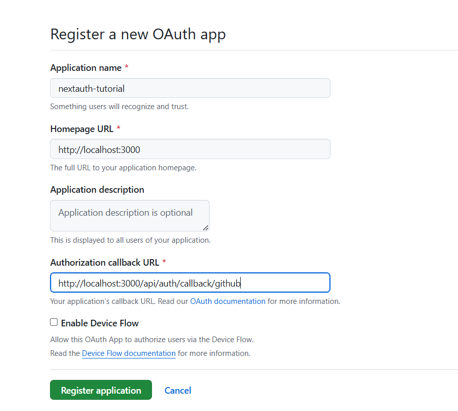

# Install required packages

```sh
npm i next-auth
```

# Register OAuth app on GitHub

https://docs.github.com/en/apps/oauth-apps/building-oauth-apps/creating-an-oauth-app


# Register OAuth app on Google

https://console.cloud.google.com/projectselector2/apis/dashboard?pli=1&supportedpurview=project
Create Credentials -> OAuth Client ID
Authorized redirect URLs: http://localhost:3000/api/auth/callback/google

# Generate secret

```sh
openssl rand -base64 32
```
